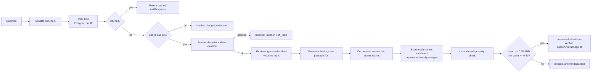

# Provenance

A retrieval system that answers only from its source documents and refuses — visibly,
with the evidence shown — when those documents don't support an answer. Live at
**[provenance.arielmagalso.com](https://provenance.arielmagalso.com)**.

**Stack:** Next.js · TypeScript · Tailwind · shadcn/ui · Supabase Postgres + pgvector ·
Claude API · Cloudflare Turnstile · Vercel

## The problem

A RAG chatbot that confidently invents a refund policy, a price, or a liability term
isn't a minor bug — it's a real liability the moment a customer acts on it. The failure
is quiet: the fabricated sentence sits in the same paragraph as four correct ones, in the
same confident voice, and nothing in the response marks it as different.

Most RAG systems optimize for "did it retrieve something relevant" and stop there. Almost
none answer the question that actually matters — *should this answer be trusted at all* —
or give the reader any way to check.

## The solution

Nothing reaches the user until a separate verification pass has tried to break it, and
every step that produced the answer is visible in the response.

- **Refusal is a first-class outcome.** When the sources don't support an answer, the
  system says so and shows the score that caused it — not an error, not a hedge.
- **Claim-level entailment, not a vibe check.** The generated answer is decomposed into
  atomic claims and each is scored against the retrieved passages. One fabricated claim
  sinks the whole answer.
- **Two gates, not one.** A mean-score threshold alone lets one invented claim hide among
  four good ones (0.9 × 4 + 0.0 still averages 0.72). A per-claim floor runs underneath it.
- **Citations that resolve.** Every answer cites passage IDs, and the corpus is linked
  from the UI so a reader can verify a refusal was actually correct.
- **Screening before spending.** Injection and off-topic checks, per-IP rate limiting,
  and a race-safe daily spend cap all run before any expensive model call.
- **The pipeline is the UI.** Screening result, retrieved passages with similarity
  scores, groundedness score, threshold, and the accept/reject decision are returned in
  one object and rendered directly — nothing is reconstructed after the fact.
- **Measured, not asserted.** A committed eval suite reports accuracy, false-refusal
  rate, and fabrication rate per bucket — including a threshold sweep whose result was
  that the threshold barely mattered, written up as-is rather than dressed up.

---

## Architecture



Every stage's timing, score, and decision is returned to the client in one
`AskResponse` object and rendered directly as the pipeline panel — nothing shown in the
UI is reconstructed after the fact.

---

## Screenshot: a refusal

_`docs/refusal-screenshot.png` — capture pending. To reproduce: `npm run dev`, click
"Ask something the docs don't cover" (or ask "Is there parking available for members
near the building?"), screenshot the resulting panel. Leading with a refusal rather
than a successful answer is deliberate — see Phase 7 in `CLAUDE.md`._

The refusal panel looks like this (captured output from a real run):

```
Screening        passed                1419ms
Retrieval        4 passages            0.85 / 0.84 / 0.84 / 0.84   1086ms
Generation       done                  33 tokens                  1957ms
Groundedness     0.00 (min claim 0.00) vs threshold 0.70 → below threshold, discarded
Result           refused
```

---

## Eval scorecard

Generated by `npm run evals`, checked into [`evals/results.md`](evals/results.md).
40 cases: 20 answerable, 12 unanswerable (including every near-miss passage from
`corpus/COVERAGE.md`), 8 adversarial.

| Bucket | N | Accuracy | False refusal rate | Fabrication rate | Mean latency |
|---|---|---|---|---|---|
| answerable | 20 | 100.0% | 0.0% | 0.0% | 7500ms |
| unanswerable | 12 | 100.0% | 0.0% | 0.0% | 3213ms |
| adversarial | 8 | 100.0% | 0.0% | 0.0% | 1585ms |
| **overall** | 40 | **100.0%** | **0.0%** | **0.0%** | 5031ms |

**Fabrication rate — answered when it should have refused — is the headline metric.**
Latency figures are for the local pipeline, not the deployed edge (evals call `lib/`
directly, bypassing Turnstile/rate-limit/HTTP — see Phase 6 in `CLAUDE.md`).

This scorecard is the result of two real bugs the eval suite caught and that got fixed
during development, not a number that was true on the first try — see
[Design decisions](#design-decisions) below.

---

## Design decisions

### Chunk size: didn't hit the 200-400 token target, and that was the right call

`scripts/ingest.ts` treats `##` headings as hard chunk boundaries — a heading's content
never merges with its neighbor, even when that leaves a chunk under 200 tokens (the
measured range is 23-154 tokens across 51 passages). I tried the alternative: soft
boundaries that merge short adjacent sections up to the 200-400 token target. It hit
the token target and collapsed the corpus to 17 overly-broad passages — which actively
hurt the thing this demo is actually testing. The near-miss passages (see
`corpus/COVERAGE.md`) depend on staying topically narrow so that "high similarity,
doesn't actually answer" is a fair test; merging unrelated headings together dilutes
that signal. This corpus is also just too small (~4,300 tokens across 8 files) to hit
both the 60-100 passage-count target and the 200-400 token-size target simultaneously —
those two targets assume a bigger source corpus than this project's. Precision-per-
passage won over hitting a token number.

### `k = 4`

Chosen to match the pipeline-panel mockup in the original spec and never revisited —
this is the one config value in the project that's a placeholder rather than a
measured decision. Worth sweeping the same way the threshold was, if this were a real
production system.

### Threshold: 0.70, but the sweep didn't actually discriminate

The eval suite sweeps 0.5/0.6/0.7/0.8 by reusing each case's already-computed
groundedness score (see `evals/run.ts`, no extra model calls). Result: **0% false
refusal and 0% fabrication at every one of the four thresholds.** That's not because
0.70 is a finely-tuned sweet spot — it's because after fixing the meta-claim bug below,
every case's score lands cleanly at 1.00 (fully supported) or 0.00 (nothing to
support), with almost nothing in between. 0.70 is kept as a sensible default with
headroom for messier real-world questions this 40-case set doesn't cover, not as a
value this specific sweep proves necessary. A corpus with genuinely partial answers
(some claims supported, some not, in the same response) would be a more informative
threshold-sweep test than this one turned out to be.

### Why screening runs before retrieval and generation

Screening (`lib/screen.ts`) and rate limiting are the only parts of the pipeline that
run before any paid model call. An injection attempt or a request past the hourly rate
limit costs nothing — no embedding call, no generation call, no grounding call. The
alternative (screen after generating, so you can log what you almost said) is common in
weaker implementations and is exactly what a spend cap is supposed to prevent.

### Why Haiku for every model call, and Supabase embeddings instead of OpenAI

This is a demo, not a quality benchmark — cost discipline is part of the engineering
story, not a compromise on it. Every model call (screening classifier, generation,
claim decomposition, entailment scoring) uses Haiku; there's no Sonnet call anywhere in
the pipeline. Combined with Supabase's free built-in `gte-small` embedding model
(384 dims, runs in a Supabase Edge Function, no OpenAI key), an uncached query costs
roughly $0.003-0.005. See [Tradeoffs](#tradeoffs-and-limitations) for what this costs
in retrieval/generation quality.

---

## Tradeoffs and limitations

**Same-model self-grading is a real weakness.** Haiku generates the answer, and Haiku
also decomposes it into claims and scores their entailment. A model is more likely to
rate its own output favorably than an independent judge would. The lexical-overlap
sanity check (`lib/ground.ts`) is a small, non-LLM countermeasure — it caps a claim's
score when it shares almost no vocabulary with any retrieved passage — but it's a
blunt instrument, not a real fix. A production system would use a different model
family (or a fine-tuned classifier) for the verification pass.

**The grounding layer had a real bug, caught by the eval suite, not by inspection.**
Early eval runs showed a 33% fabrication rate on the unanswerable bucket — the model
would write an answer like *"the passages don't mention parking near the building,"*
and claim decomposition treated that as a verifiable claim, which the entailment
scorer then rated as trivially "supported" (since it's technically true the passages
are silent). The fix was two-sided: `lib/generate.ts` now returns an empty answer
rather than writing prose about what isn't covered, and `lib/ground.ts`'s claim
decomposition explicitly excludes meta-commentary about the source material. Both are
prompt-level fixes, which means this class of bug isn't provably closed — it's
mitigated for the cases in this eval set.

**Citations are derived from verified support, not the model's self-report — and that
distinction mattered in practice.** `lib/generate.ts` asks the model to both write an
answer and separately list which passages it used. During eval iteration, Haiku
repeatedly wrote a fully specific, correctly-grounded answer while leaving that
citations array empty — the two parts of a single structured-output call drifting out
of sync. `deriveCitations()` in `lib/ground.ts` sidesteps this by deriving the citations
shown to the user from `supportingPassageIds` on each claim the grounding layer already
verified, rather than trusting the generator's self-report at all.

**The corpus is small (51 passages) and deliberately hand-curated for clean gaps and
near-misses.** A real production corpus would be orders of magnitude larger and would
have vocabulary overlap in messier, less deliberate ways. The `k = 4` retrieval depth
and the exact-scan (no ivfflat index) approach to `passages` are both fine at this
scale and would need real reconsideration well before 10,000+ passages — see the "no
ivfflat" note in `supabase/migrations`.

**The spend cap uses a flat per-query cost estimate, not metered actual token usage**
(`ESTIMATED_COST_SCREEN_USD` / `ESTIMATED_COST_PIPELINE_USD` in `lib/limit.ts`). It's
charged before the call and refunded if it pushes the day over budget, which is
race-safe, but a genuinely expensive outlier response (a very long generation, for
instance) is under-charged relative to its real cost. Fine for a demo with an
aggressive daily cap; not fine as the only safeguard at real scale.

**What's next, if this stops being a portfolio piece and starts being a real product:**
a second model family for the verification pass, a much larger and messier corpus to
actually stress the threshold, per-token spend metering instead of flat estimates, and
a `k` value chosen from a real sweep instead of inherited from a spec's mockup.

---

## Stack

Next.js (App Router, TypeScript strict) · Tailwind · Supabase Postgres + pgvector ·
Supabase `gte-small` embeddings via an Edge Function · Claude Haiku for every model
call · Postgres-backed rate limiting / cache / spend cap (no Redis) · Cloudflare
Turnstile · Vercel.

See `CLAUDE.md` for the full spec and the reasoning behind every deviation from the
original brief.

---

## Run locally

```bash
git clone <this-repo>
cd grounded-rag
npm install
cp .env.example .env.local   # fill in ANTHROPIC_API_KEY and Supabase keys
npm run ingest                # chunk, embed, upsert the corpus
npm run warm-cache             # pre-warm the 3 example questions (budget-exhausted fallback)
npm run evals                  # optional — regenerates evals/results.md
npm run dev
```

Requires a Supabase project with the migrations in `supabase/migrations/` applied, and
the `embed` Edge Function in `supabase/functions/embed/` deployed. `.env.example`'s
Turnstile keys default to Cloudflare's published "always passes" test keys, which work
for local dev with no Cloudflare account — swap them for real ones before sharing a
public URL (see non-negotiable #4 in `CLAUDE.md`).

---

## Possible extensions

Deliberately out of scope for this project (see `CLAUDE.md`): user accounts, corpus
editing via UI, multi-turn memory, streaming responses, reranking/hybrid search, an
admin dashboard. Any of these would be a reasonable next step for a real product built
on this pipeline, not a gap in this demo.
